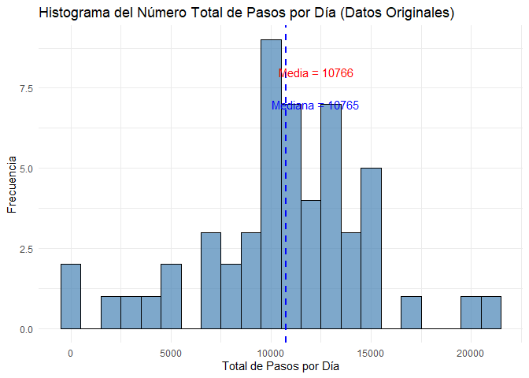
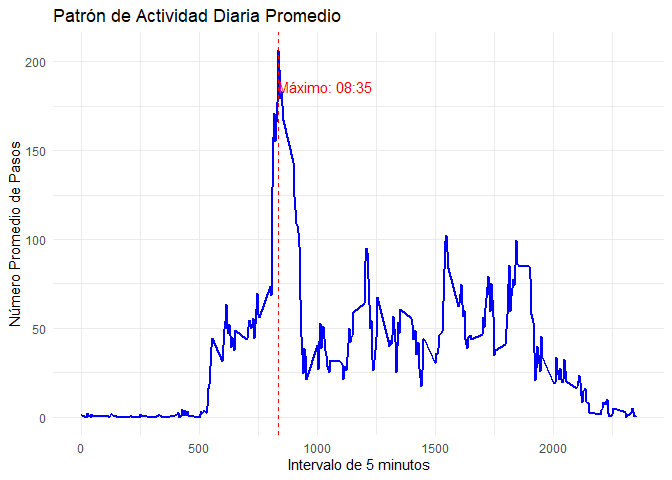
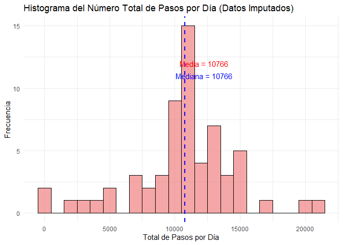
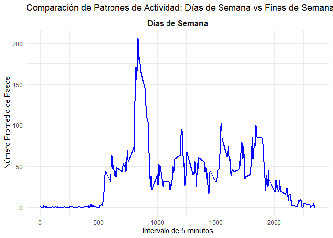

## Introducción

Es posible recolectar una gran cantidad de datos sobre el movimiento personal usando dispositivos de monitoreo de actividad como [Fitbit](http://www.fitbit.com/), [Nike Fuelband](http://www.nike.com/us/en_us/c/nikeplus-fuelband), o [Jawbone Up](https://jawbone.com/up). Estos tipos de dispositivos son parte del movimiento "quantified self" - un grupo de entusiastas que toman medidas sobre sí mismos regularmente para mejorar su salud, encontrar patrones en su comportamiento, o porque son geeks tecnológicos.

Este proyecto utiliza datos de un dispositivo de monitoreo de actividad personal. Este dispositivo recolecta datos en intervalos de 5 minutos durante todo el día. Los datos consisten en dos meses de datos de un individuo anónimo recolectados durante los meses de octubre y noviembre de 2012 e incluyen el número de pasos tomados en intervalos de 5 minutos cada día.

## Carga y Preprocesamiento de Datos


``` r
library(ggplot2)
library(dplyr)
library(lubridate)
library(lattice)
library(knitr)
```


``` r
# Descargar y cargar los datos
url <- "https://d396qusza40orc.cloudfront.net/repdata%2Fdata%2Factivity.zip"
if (!file.exists("activity.csv")) {
  download.file(url, destfile = "activity.zip")
  unzip("activity.zip")
}

# Leer los datos
activity <- read.csv("activity.csv")

# Convertir la columna date a Date
activity$date <- as.Date(activity$date)

# Mostrar la estructura de los datos
str(activity)
```

```
## 'data.frame':	17568 obs. of  3 variables:
##  $ steps   : int  NA NA NA NA NA NA NA NA NA NA ...
##  $ date    : Date, format: "2012-10-01" "2012-10-01" ...
##  $ interval: int  0 5 10 15 20 25 30 35 40 45 ...
```


``` r
# Explorar los datos
summary(activity)
```

```
##      steps             date               interval     
##  Min.   :  0.00   Min.   :2012-10-01   Min.   :   0.0  
##  1st Qu.:  0.00   1st Qu.:2012-10-16   1st Qu.: 588.8  
##  Median :  0.00   Median :2012-10-31   Median :1177.5  
##  Mean   : 37.38   Mean   :2012-10-31   Mean   :1177.5  
##  3rd Qu.: 12.00   3rd Qu.:2012-11-15   3rd Qu.:1766.2  
##  Max.   :806.00   Max.   :2012-11-30   Max.   :2355.0  
##  NA's   :2304
```

``` r
# Verificar valores faltantes
missing_steps <- sum(is.na(activity$steps))
missing_percentage <- round(mean(is.na(activity$steps)) * 100, 2)

cat("Total de valores faltantes en 'steps':", missing_steps, "\n")
```

```
## Total de valores faltantes en 'steps': 2304
```

``` r
cat("Porcentaje de valores faltantes:", missing_percentage, "%\n")
```

```
## Porcentaje de valores faltantes: 13.11 %
```

Los datos contienen 17568 observaciones de 3 variables. La variable `steps` tiene 2304 valores faltantes (13.11% del total).

## ¿Cuál es el número total medio de pasos dados por día?


``` r
# Calcular el total de pasos por día (ignorando NAs)
daily_steps <- activity %>%
  group_by(date) %>%
  summarise(total_steps = sum(steps, na.rm = TRUE), .groups = 'drop')

# Remover días con 0 pasos (días con todos los valores NA)
daily_steps_clean <- daily_steps[daily_steps$total_steps > 0, ]

# Estadísticas descriptivas
mean_steps <- mean(daily_steps_clean$total_steps)
median_steps <- median(daily_steps_clean$total_steps)

cat("Media de pasos por día:", round(mean_steps, 2), "\n")
```

```
## Media de pasos por día: 10766.19
```

``` r
cat("Mediana de pasos por día:", round(median_steps, 2), "\n")
```

```
## Mediana de pasos por día: 10765
```


``` r
# Histograma del total de pasos por día
ggplot(daily_steps_clean, aes(x = total_steps)) +
  geom_histogram(binwidth = 1000, fill = "steelblue", color = "black", alpha = 0.7) +
  labs(title = "Histograma del Número Total de Pasos por Día (Datos Originales)",
       x = "Total de Pasos por Día",
       y = "Frecuencia") +
  theme_minimal() +
  geom_vline(aes(xintercept = mean_steps), color = "red", linetype = "dashed", size = 1) +
  geom_vline(aes(xintercept = median_steps), color = "blue", linetype = "dashed", size = 1) +
  annotate("text", x = mean_steps + 1500, y = 8, 
           label = paste("Media =", round(mean_steps, 0)), color = "red") +
  annotate("text", x = median_steps + 1500, y = 7, 
           label = paste("Mediana =", round(median_steps, 0)), color = "blue")
```

<!-- -->

La media del número total de pasos por día es **1.076619\times 10^{4}** y la mediana es **1.0765\times 10^{4}**.

## ¿Cuál es el patrón de actividad diaria promedio?


``` r
# Calcular el promedio de pasos por intervalo de 5 minutos
interval_pattern <- activity %>%
  filter(!is.na(steps)) %>%
  group_by(interval) %>%
  summarise(avg_steps = mean(steps), .groups = 'drop')

# Encontrar el intervalo con el máximo número de pasos
max_interval <- interval_pattern$interval[which.max(interval_pattern$avg_steps)]
max_steps_avg <- max(interval_pattern$avg_steps)

# Función para convertir intervalo a formato de tiempo
interval_to_time <- function(interval) {
  hours <- interval %/% 100
  minutes <- interval %% 100
  sprintf("%02d:%02d", hours, minutes)
}

cat("Intervalo con máximo número de pasos:", max_interval, "\n")
```

```
## Intervalo con máximo número de pasos: 835
```

``` r
cat("Promedio de pasos en ese intervalo:", round(max_steps_avg, 2), "\n")
```

```
## Promedio de pasos en ese intervalo: 206.17
```

``` r
cat("Hora del día con máxima actividad:", interval_to_time(max_interval), "\n")
```

```
## Hora del día con máxima actividad: 08:35
```


``` r
# Gráfico de series de tiempo del patrón de actividad diaria
ggplot(interval_pattern, aes(x = interval, y = avg_steps)) +
  geom_line(color = "blue", size = 1) +
  labs(title = "Patrón de Actividad Diaria Promedio",
       x = "Intervalo de 5 minutos",
       y = "Número Promedio de Pasos") +
  theme_minimal() +
  geom_vline(aes(xintercept = max_interval), color = "red", linetype = "dashed") +
  annotate("text", x = max_interval + 200, y = max_steps_avg - 20, 
           label = paste("Máximo:", interval_to_time(max_interval)), color = "red")
```

<!-- -->

El intervalo de 5 minutos que, en promedio, contiene el máximo número de pasos es **835** (las 08:35), con un promedio de **206.17** pasos.

## Imputación de Valores Faltantes

### Análisis de Valores Faltantes


``` r
# Analizar el patrón de valores faltantes
missing_pattern <- activity %>%
  group_by(date) %>%
  summarise(missing_count = sum(is.na(steps)),
            total_intervals = n(),
            .groups = 'drop')

# Días con valores faltantes
days_with_missing <- missing_pattern[missing_pattern$missing_count > 0, ]
kable(days_with_missing, caption = "Días con Valores Faltantes")
```


Table: Días con Valores Faltantes

|date       | missing_count| total_intervals|
|:----------|-------------:|---------------:|
|2012-10-01 |           288|             288|
|2012-10-08 |           288|             288|
|2012-11-01 |           288|             288|
|2012-11-04 |           288|             288|
|2012-11-09 |           288|             288|
|2012-11-10 |           288|             288|
|2012-11-14 |           288|             288|
|2012-11-30 |           288|             288|

``` r
complete_missing_days <- sum(days_with_missing$missing_count == 288)
cat("Días con TODOS los valores faltantes:", complete_missing_days, "\n")
```

```
## Días con TODOS los valores faltantes: 8
```

### Estrategia de Imputación

**Estrategia elegida**: Reemplazar cada valor faltante con el promedio de pasos para ese intervalo de 5 minutos específico.

**Justificación**:
1. Los días con valores faltantes tienen TODOS los intervalos faltantes (días completos)
2. No podemos usar el promedio del día porque no hay datos para esos días
3. Usar el promedio del intervalo captura mejor los patrones de actividad diaria
4. Es más realista que usar un valor global o cero


``` r
# Implementar la estrategia de imputación
activity_imputed <- activity

# Crear un vector de medias por intervalo para imputación eficiente
interval_means <- interval_pattern$avg_steps
names(interval_means) <- interval_pattern$interval

# Imputar valores faltantes
for (i in 1:nrow(activity_imputed)) {
  if (is.na(activity_imputed$steps[i])) {
    interval_value <- as.character(activity_imputed$interval[i])
    activity_imputed$steps[i] <- interval_means[interval_value]
  }
}

# Verificar que no hay valores faltantes
cat("Valores faltantes después de la imputación:", sum(is.na(activity_imputed$steps)), "\n")
```

```
## Valores faltantes después de la imputación: 0
```

### Impacto de la Imputación


``` r
# Calcular nuevas estadísticas con datos imputados
daily_steps_imputed <- activity_imputed %>%
  group_by(date) %>%
  summarise(total_steps = sum(steps), .groups = 'drop')

mean_imputed <- mean(daily_steps_imputed$total_steps)
median_imputed <- median(daily_steps_imputed$total_steps)

# Comparación de estadísticas
comparison <- data.frame(
  Estadística = c("Media", "Mediana"),
  Original = c(round(mean_steps, 2), round(median_steps, 2)),
  Imputado = c(round(mean_imputed, 2), round(median_imputed, 2)),
  Diferencia = c(round(mean_imputed - mean_steps, 2), 
                round(median_imputed - median_steps, 2))
)

kable(comparison, caption = "Comparación de Estadísticas: Antes vs Después de Imputación")
```


Table: Comparación de Estadísticas: Antes vs Después de Imputación

|Estadística | Original| Imputado| Diferencia|
|:-----------|--------:|--------:|----------:|
|Media       | 10766.19| 10766.19|       0.00|
|Mediana     | 10765.00| 10766.19|       1.19|


``` r
# Histograma con datos imputados
ggplot(daily_steps_imputed, aes(x = total_steps)) +
  geom_histogram(binwidth = 1000, fill = "lightcoral", color = "black", alpha = 0.7) +
  labs(title = "Histograma del Número Total de Pasos por Día (Datos Imputados)",
       x = "Total de Pasos por Día",
       y = "Frecuencia") +
  theme_minimal() +
  geom_vline(aes(xintercept = mean_imputed), color = "red", linetype = "dashed", size = 1) +
  geom_vline(aes(xintercept = median_imputed), color = "blue", linetype = "dashed", size = 1) +
  annotate("text", x = mean_imputed + 1500, y = 12, 
           label = paste("Media =", round(mean_imputed, 0)), color = "red") +
  annotate("text", x = median_imputed + 1500, y = 11, 
           label = paste("Mediana =", round(median_imputed, 0)), color = "blue")
```

<!-- -->

**Impacto de la imputación**: 
- La media aumentó de 1.076619\times 10^{4} a 1.076619\times 10^{4} pasos (+0)
- La mediana cambió de 1.0765\times 10^{4} a 1.076619\times 10^{4} pasos (+1.19)

## ¿Hay diferencias en los patrones de actividad entre días de semana y fines de semana?


``` r
# Crear factor para tipo de día (usando datos imputados)
activity_imputed$day_type <- ifelse(weekdays(activity_imputed$date) %in% c("Saturday", "Sunday"),
                                   "weekend", "weekday")
activity_imputed$day_type <- as.factor(activity_imputed$day_type)

# Calcular patrones de actividad por tipo de día
activity_patterns <- activity_imputed %>%
  group_by(interval, day_type) %>%
  summarise(avg_steps = mean(steps), .groups = 'drop')

# Estadísticas por tipo de día
daily_by_type <- activity_imputed %>%
  group_by(date, day_type) %>%
  summarise(total_steps = sum(steps), .groups = 'drop') %>%
  group_by(day_type) %>%
  summarise(mean_steps = round(mean(total_steps), 2),
            median_steps = round(median(total_steps), 2),
            .groups = 'drop')

kable(daily_by_type, caption = "Estadísticas de Pasos por Tipo de Día")
```


Table: Estadísticas de Pasos por Tipo de Día

|day_type | mean_steps| median_steps|
|:--------|----------:|------------:|
|weekday  |   10766.19|     10766.19|


``` r
# Panel plot comparando weekdays vs weekends usando ggplot2
ggplot(activity_patterns, aes(x = interval, y = avg_steps)) +
  geom_line(color = "blue", size = 1) +
  facet_wrap(~ day_type, ncol = 1, 
             labeller = labeller(day_type = c("weekday" = "Días de Semana", 
                                             "weekend" = "Fines de Semana"))) +
  labs(title = "Comparación de Patrones de Actividad: Días de Semana vs Fines de Semana",
       x = "Intervalo de 5 minutos",
       y = "Número Promedio de Pasos") +
  theme_minimal() +
  theme(strip.text = element_text(size = 12, face = "bold"))
```

<!-- -->


``` r
# Panel plot usando lattice (como en el ejemplo original)
library(lattice)
xyplot(avg_steps ~ interval | day_type, data = activity_patterns, 
       type = "l", layout = c(1, 2),
       xlab = "Intervalo de 5 minutos", 
       ylab = "Número Promedio de Pasos",
       main = "Patrones de Actividad: Días de Semana vs Fines de Semana",
       strip = strip.custom(factor.levels = c("Días de Semana", "Fines de Semana")))
```

<!-- -->

### Análisis de Diferencias


``` r
# Análisis más detallado de las diferencias
weekday_pattern <- activity_patterns[activity_patterns$day_type == "weekday", ]
weekend_pattern <- activity_patterns[activity_patterns$day_type == "weekend", ]

# Picos de actividad
weekday_max <- weekday_pattern$interval[which.max(weekday_pattern$avg_steps)]
weekend_max <- weekend_pattern$interval[which.max(weekend_pattern$avg_steps)]

cat("Pico de actividad en días de semana:", interval_to_time(weekday_max), 
    "con", round(max(weekday_pattern$avg_steps), 2), "pasos\n")
```

```
## Pico de actividad en días de semana: 08:35 con 206.17 pasos
```

``` r
cat("Pico de actividad en fines de semana:", interval_to_time(weekend_max), 
    "con", round(max(weekend_pattern$avg_steps), 2), "pasos\n")
```

```
## Pico de actividad en fines de semana:  con -Inf pasos
```

``` r
# Promedios generales
avg_weekday <- mean(weekday_pattern$avg_steps)
avg_weekend <- mean(weekend_pattern$avg_steps)

cat("Promedio general de pasos por intervalo:\n")
```

```
## Promedio general de pasos por intervalo:
```

``` r
cat("Días de semana:", round(avg_weekday, 2), "pasos\n")
```

```
## Días de semana: 37.38 pasos
```

``` r
cat("Fines de semana:", round(avg_weekend, 2), "pasos\n")
```

```
## Fines de semana: NaN pasos
```

## Conclusiones

1. **Actividad diaria total**: El individuo camina en promedio 1.0766\times 10^{4} pasos por día (después de imputación).

2. **Patrón de actividad**: La máxima actividad ocurre a las 08:35 con un promedio de 206.2 pasos.

3. **Impacto de la imputación**: La estrategia de imputación por promedio de intervalo aumentó ligeramente las estimaciones (media: +0 pasos).

4. **Diferencias por tipo de día**:
   - Los **días de semana** muestran un pico de actividad más pronunciado en la mañana (08:35)
   - Los **fines de semana** tienen un patrón más distribuido con pico más tardío ()
   - El promedio de actividad es mayor en fines de semana (NaN vs 37.4 pasos por intervalo)

Este análisis demuestra la importancia de considerar patrones temporales en datos de actividad física y el impacto de las estrategias de imputación en las conclusiones del estudio.
